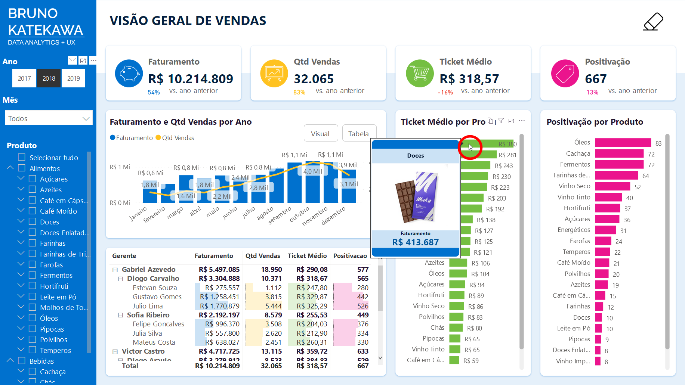

# Sales Dashboard - Retail

## Introduction

Oftentimes businesses need to keep track of all data that is generated by their operation, so visualizing and interacting with the data is one of the first steps to examine trends and patterns. Thus, a Dashboard is the most recommended solution to view relevant business KPIs and results at a glance.

 

---

## Sales Overview

 

### Sales Overview - Product Tooltip

 

### Sales Overview - Goal tooltip

 

---

## Salesmen Rank

 

---

## Product Price Forecast

 

---

## Market Basket Analysis for cross-sell

